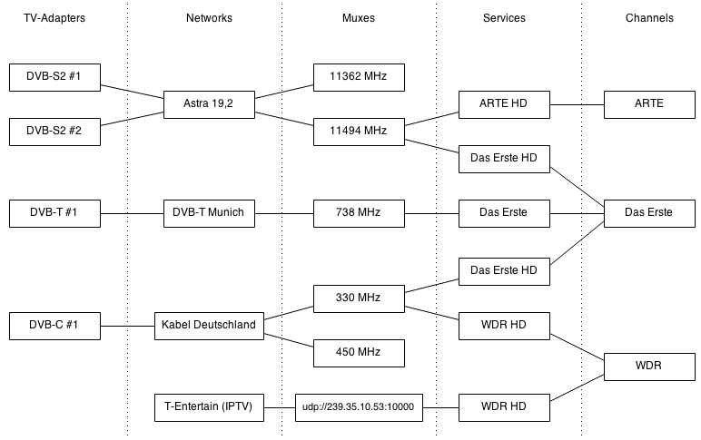

##Before you begin

There are some basic concepts that will make life much easier if you understand them from the outset.

####Hardware/Software Fundamentals

* A *tuner* is the hardware (chipset) needed to interpret a digital television signal and extract from it the programme stream. The tuner hardware is also responsible for communicating with your satellite dish (technically, the LNB) for DVB-S reception.

* A *driver* is the piece of software that your operating system uses to talk to the tuner. This can be built into the OS (e.g. 'supported since kernel X') or might be a separate piece of software (e.g. 'compile and install...'). If it's separate software, it may be because it's closed-source (and thus comes from the manufacturer) or because support hasn't yet made it to your kernel (so you end up installing a custom or new version of v4l).

* *Firmware* is a small piece of binary microcode that your system sends to the tuner upon initialisation. This is the cause of more problems than you'd imagine... if you find yourself in times of trouble, this is the first thing to check along with kernel support for your hardware.

####Application/tvheadend Fundamentals

The tvheadend software then sets up a series of configuration elements, and the way in which these interact determines how a TV signal ends up in front of you. They all use what's known as a _many-to-many_ relationship, in that one configuration element can be related to multiple elements of the next type, and vice versa: one tuner has multiple networks, one network can exist on multiple tuners. 

* The *network* is the software definition of your carrier network. Broadly, it lays out what sort of network it is (e.g. DVB-T2), how it gets scanned, where the satellite (for DVB-S) is in orbit, and similar. Networks are used by tuners so the hardware knows where to look for a signal.

* Networks then have *muxes*. These are the carrier frequencies (equivalent to the old analogue channels, e.g. 520MHz) that are used to transmit multiple digital signals. These signals are multiplexed together, hence the name _mux_.

* Muxes then carry *services*. These are the individual streams of data that carry a TV or radio programme; they can also carry data services (e.g. digital teletext, or to communicate things such as catch-up IPTV services).

* And finally, services are mapped to *channels*. These are what you (and thus the software you're likely to be using, such as Kodi) think in terms of: _"I'd like to watch BBC One now, please"_.

Why the complexity? Because 'BBC One' might exist in many different places... it might have regional variations on multiple frequencies (services, muxes); it might exist on more than one source (two different satellites); and it might thus be accessible through more than one piece of hardware (two satellite tuners, or a satellite tuner and a terrestrial/DVB-T tuner). When you select the channel you want to watch or record, tvheadend can then map a path through all those variables to ask a particular tuner to go and get the signal for you.

The following diagram explains the relationship between these components:

