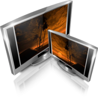

#Tvheadend 4.0 User Guide

Version: DRAFT-2015-05-26

#Purpose

This document is intended to give you a high-level overview of how to set 
up Tvheadend for the first time. It does not aim to provide a complete description
of every step; instead, consult the on-line (web interface) help as you 
set things up, as there is much more information in those pages that will
help you with specific configuration issues.

Think of this as the map on how to get there, not the instruction manual about how to drive.

Note: if we can include the web help in this document as well, then the above
obviously falls into the category of 'not really true any more'.
