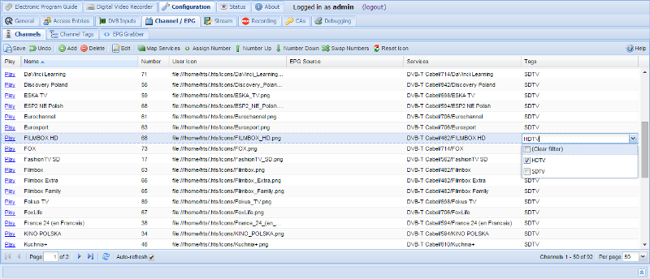

##Configuration - Channel/EPG - Channels

Display and edit channel configuration here.

The channels are listed / edited in a grid.

* To edit a cell, double-click on it. After a cell is changed it will
  flags one of its corner to red to indicated that it has been
  changed. To commit these changes back to Tvheadend press the ‘Save
  changes’ button. In order to change a Checkbox cell you only have to
  click once in it.

* To delete one or more entries, select the lines (by clicking once on
  them), and press the ‘Delete selected’ button. A popup will ask you
  to confirm your request.

---

####Menu Bar

The menu bar items have the following functions:

**Save**

**Undo**

**Add**

**Delete**

**Edit**

**Map Services**

**Assign Number**

**Number Up**

**Number Down**

**Swap Number**

**Reset Icon**

---

####Columns

The columns have the following functions:

**Play**
:   Direct play link using the HTTP streaming.

  URL to the stream using a channel name:
    `http://*host:port*/play/stream/channelname/*channel\_name*`
    
  URL to the stream using a channel number:
    `http://*host:port*/play/stream/channelnumber/*channel\_number*`

**Enabled**
:   Whether or not the mux is enabled and thus available.
    Channel number. This is not used by Tvheadend internally, but rather
    intended to be used by HTSP clients for mapping to remote control
    buttons, presentation order, etc

**Number**
:   Channel number. This is not used by Tvheadend internally, but rather
    intended to be used by HTSP clients for mapping to remote control
    buttons, presentation order, etc

**Name**
:   Name of the channel as presented in EPG and external interfaces.
    Changing name of a channel does not interfere with scheduled recordings,
    etc.

**Play**
:   Play the channel using the VLC plugin (if available) else it will
    display a direct link that can be used to open in preferred media
    player.

**Auto EPG Channel**
:   Auto-link EPG channels from XMLTV and OpenTV EPG grabbers using the
    channel name for matching. If you turn this option off, only OTA EPG
    grabber will be used for this channel unless the EPG Grab Source option
    (below) is not set manually.

**EPG Grab Source**
:   Name of the Internet-based EPG provider (typically XMLTV) channel that
    should be used to update this channels EPG info. By default Tvheadend
    tries to match the name itself, but sometimes it might not match
    correctly in which case you can do the mapping manually. When using
    XMLTV, a newly-mapped channel will not appear in the EPG until the next
    run of the grabber, or service restart.
    
  Over the air (OTA) sources do NOT need to be mapped in this way, the
  linking is implicitly tied since they are all part of the DVB system.

**Tags**
:   Each channel can be bound to a zero, one or many tags. The tags are used
    for multiple things and it’s up to you how you wish to use and name
    them. Tags can be used to aid searching in the EPG if you have many
    channels. The tags are also presented in a Media player.

**User Icon**
:   A URL pointing to an image representing the channel. The icon URL will
    be set automatically when importing data from XMLTV, when picon path is
    set or when channel icon path is set in the general config. This field
    allows the user to edit it manually. The reset icon action allows to
    re-set the automatic URL for selected channel (e.g. after configuration
    change).

**DVR Pre-Start**
:   Allows the user to specify an amount of extra time that should be
    prepended to a recording scheduled on this channel. In other words, if
    you type 5 here for a recording that is scheduled for 20:00 will start
    to record at 19:55. This setting overrides the Extra time before
    recordings DVR setting.

**DVR Post-End**
:   Similar to DVR Pre-Start this allows the user to add an extra amount of
    time that should be appended to a recording. In other words, if you type
    5 here for a recording that is scheduled to end 20:30 will stop to
    record at 20:35. This setting overrides the Extra time after recordings
    DVR setting.
